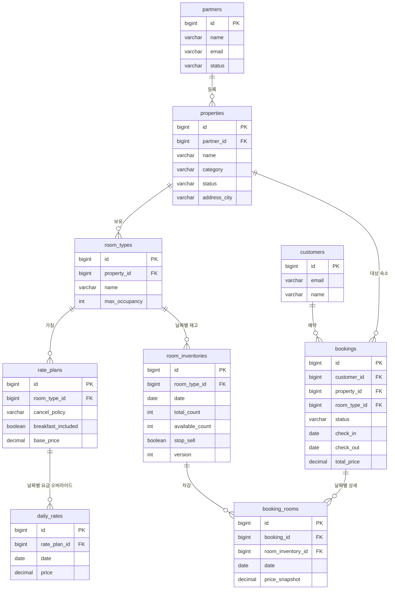

# ERD (Entity Relationship Diagram)

> 작성일: 2026-04-16
> 버전: v1.0

---

## 1. 전체 ERD

```
┌──────────────────┐
│     partners     │
├──────────────────┤
│ id (PK)          │
│ name             │
│ email            │
│ phone            │
│ business_number  │
│ status           │ ── PENDING, ACTIVE, SUSPENDED
│ created_at       │
│ updated_at       │
└────────┬─────────┘
         │ 1
         │
         │ N
┌────────▼─────────────────────────────┐
│              properties              │
├──────────────────────────────────────┤
│ id (PK)                              │
│ partner_id (FK → partners.id)        │
│ name                                 │
│ description                          │
│ category                             │ ── HOTEL, PENSION, GUESTHOUSE, RESORT, MOTEL
│ status                               │ ── PENDING_APPROVAL, ACTIVE, INACTIVE
│ address_city                         │
│ address_district                     │
│ address_detail                       │
│ latitude                             │
│ longitude                            │
│ check_in_time                        │
│ check_out_time                       │
│ created_at                           │
│ updated_at                           │
└────────┬─────────────────────────────┘
         │ 1
         │
         │ N
┌────────▼─────────────────────────────┐
│             room_types               │
├──────────────────────────────────────┤
│ id (PK)                              │
│ property_id (FK → properties.id)     │
│ name                                 │ ── Standard, Deluxe, Suite 등
│ description                          │
│ max_occupancy                        │
│ bed_type                             │ ── SINGLE, DOUBLE, TWIN, KING
│ size_sqm                             │
│ amenities                            │ ── JSON (["wifi","parking","breakfast"])
│ created_at                           │
│ updated_at                           │
└────────┬─────────────────────────────┘
         │ 1                         │ 1
         │                           │
         │ N                         │ N
┌────────▼──────────────────┐ ┌──────▼──────────────────────────────┐
│        rate_plans         │ │          room_inventories            │
├───────────────────────────┤ ├──────────────────────────────────────┤
│ id (PK)                   │ │ id (PK)                              │
│ room_type_id (FK)         │ │ room_type_id (FK → room_types.id)    │
│ name                      │ │ date                                 │ ── DATE 타입
│ cancel_policy             │ │ total_count                          │ ── 총 객실 수
│  ── FREE_CANCEL           │ │ available_count                      │ ── 가용 객실 수
│  ── NON_REFUNDABLE        │ │ stop_sell                            │ ── 강제 판매 중단
│  ── PARTIAL_REFUND        │ │ min_stay                             │ ── 최소 숙박일
│ breakfast_included        │ │ max_stay                             │ ── 최대 숙박일
│ base_price                │ │ version                              │ ── 낙관적 락용
│ is_active                 │ │ created_at                           │
│ created_at                │ │ updated_at                           │
│ updated_at                │ │                                      │
└────────┬──────────────────┘ │ UNIQUE (room_type_id, date)          │
         │ 1                  └──────────────────────────────────────┘
         │                              ▲
         │ N                            │ SELECT FOR UPDATE (예약 시)
┌────────▼──────────────────┐           │
│        daily_rates        │           │
├───────────────────────────┤           │
│ id (PK)                   │           │
│ rate_plan_id (FK)         │           │
│ date                      │           │
│ price                     │           │ ── base_price 오버라이드
│ created_at                │           │
│ updated_at                │           │
│                           │           │
│ UNIQUE (rate_plan_id,date)│           │
└───────────────────────────┘           │
                                        │
┌───────────────────────────────────────┘
│
│        ┌──────────────────────────────────────┐
│        │             customers                │
│        ├──────────────────────────────────────┤
│        │ id (PK)                              │
│        │ email                                │
│        │ name                                 │
│        │ phone                                │
│        │ created_at                           │
│        └────────────┬─────────────────────────┘
│                     │ 1
│                     │
│                     │ N
│        ┌────────────▼─────────────────────────┐
│        │              bookings                │
│        ├──────────────────────────────────────┤
│        │ id (PK)                              │
│        │ customer_id (FK → customers.id)      │
│        │ property_id (FK → properties.id)     │
│        │ room_type_id (FK → room_types.id)    │
│        │ rate_plan_id (FK → rate_plans.id)    │
│        │ status                               │ ── CONFIRMED, CANCELLED
│        │ check_in                             │
│        │ check_out                            │
│        │ guest_count                          │
│        │ total_price                          │
│        │ guest_name                           │
│        │ guest_phone                          │
│        │ special_request                      │
│        │ cancelled_at                         │
│        │ cancel_reason                        │
│        │ created_at                           │
│        │ updated_at                           │
└────────┤                                      │
         └────────────┬─────────────────────────┘
                      │ 1
                      │
                      │ N
         ┌────────────▼─────────────────────────┐
         │           booking_rooms              │
         ├──────────────────────────────────────┤
         │ id (PK)                              │
         │ booking_id (FK → bookings.id)        │
         │ room_inventory_id (FK)               │ ── 어떤 날짜 재고를 차감했는지
         │ date                                 │
         │ price_snapshot                       │ ── 예약 시점 가격 (불변)
         │ created_at                           │
         └──────────────────────────────────────┘
```

---

## 2. Supplier 관련 테이블

```
┌──────────────────────────────────────┐
│          external_suppliers          │
├──────────────────────────────────────┤
│ id (PK)                              │
│ name                                 │ ── "SupplierA", "Hotelbeds" 등
│ adapter_type                         │ ── SUPPLIER_A, SUPPLIER_B (Enum)
│ api_endpoint                         │
│ api_key (encrypted)                  │
│ is_active                            │
│ created_at                           │
│ updated_at                           │
└──────────────────────────────────────┘
```

> Supplier의 실제 상품 정보는 외부 API에서 실시간으로 조회하므로 별도 테이블로 캐싱하지 않는다.
> 필요 시 Redis에 단기 캐싱(TTL 5분)으로 대응한다.

---

## 3. 테이블별 핵심 인덱스

| 테이블 | 인덱스 | 목적 |
|--------|--------|------|
| properties | `(status, address_city)` | 도시별 활성 숙소 검색 |
| room_inventories | `UNIQUE (room_type_id, date)` | 날짜별 재고 단일 행 보장 |
| room_inventories | `(room_type_id, date, available_count)` | 가용 재고 빠른 조회 |
| daily_rates | `UNIQUE (rate_plan_id, date)` | 날짜별 요금 단일 행 보장 |
| bookings | `(customer_id, status)` | 고객별 예약 조회 |
| bookings | `(property_id, check_in, check_out)` | 숙소별 예약 현황 조회 |
| booking_rooms | `(booking_id)` | 예약별 날짜 상세 조회 |

---

## 4. 주요 설계 결정

### 4.1 재고를 날짜별 독립 행으로 관리

```sql
-- room_inventories 예시 데이터
| id | room_type_id | date       | total_count | available_count | stop_sell |
|----|-------------|------------|-------------|-----------------|-----------|
|  1 |           1 | 2026-05-01 |           5 |               5 | false     |
|  2 |           1 | 2026-05-02 |           5 |               3 | false     |
|  3 |           1 | 2026-05-03 |           5 |               0 | false     |
```

**이유:** 체크인~체크아웃 기간의 각 날짜 재고를 독립적으로 차감해야 한다.
날짜별 단일 행이므로 잠금 범위가 최소화되고 병렬 예약 처리 시 경합이 줄어든다.

### 4.2 booking_rooms에 price_snapshot 저장

요금은 시간이 지나면 변경될 수 있다. 예약 시점의 가격을 `booking_rooms.price_snapshot`에 불변 값으로 저장하여 정산, 분쟁, 히스토리 추적에 활용한다.

### 4.3 DailyRate로 기본 요금 오버라이드

`rate_plans.base_price`는 기본값이고, 파트너가 특정 날짜에 다른 가격을 설정하면 `daily_rates` 테이블에 행이 생성된다.
요금 조회 시: `daily_rates` 우선 조회 → 없으면 `rate_plans.base_price` 사용.

```sql
SELECT COALESCE(dr.price, rp.base_price) AS effective_price
FROM rate_plans rp
LEFT JOIN daily_rates dr
  ON dr.rate_plan_id = rp.id AND dr.date = :date
WHERE rp.id = :ratePlanId;
```

### 4.4 bookings에 property_id, room_type_id 비정규화

`booking_rooms`를 통해 조회할 수 있지만, 예약 목록 조회 시 매번 JOIN을 피하기 위해 `bookings`에도 직접 저장한다. 예약 시점 이후 변경되지 않는 값이므로 데이터 정합성 문제가 없다.

---

## 5. 동시 예약 처리 흐름 (SQL)

체크인 2026-05-01, 체크아웃 2026-05-03 (2박) 예약 시:

```sql
-- 1. 해당 날짜 범위 재고 행 전체에 비관적 락
SELECT * FROM room_inventories
WHERE room_type_id = 1
  AND date IN ('2026-05-01', '2026-05-02')
  AND stop_sell = false
FOR UPDATE;

-- 2. 모든 날짜 available_count > 0 검증 (애플리케이션 레벨)

-- 3. 재고 차감
UPDATE room_inventories
SET available_count = available_count - 1
WHERE room_type_id = 1
  AND date IN ('2026-05-01', '2026-05-02');

-- 4. 예약 생성
INSERT INTO bookings (...) VALUES (...);
INSERT INTO booking_rooms (...) VALUES (...); -- 날짜별 행
```

동시에 같은 날짜에 예약 요청이 들어오면 두 번째 트랜잭션은 `FOR UPDATE` 단계에서 대기하고,
첫 번째 트랜잭션 커밋 후 재고를 확인하여 `available_count = 0`이면 예약 실패를 반환한다.

---

## 6. Mermaid ERD (요약)


